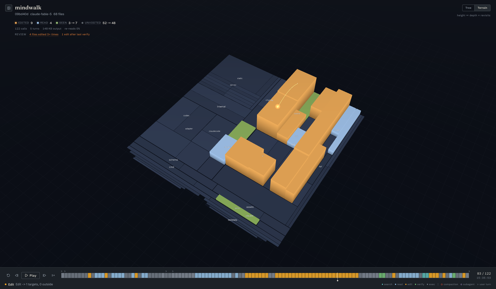

#  mindwalk

A visualization tool that replays coding-agent sessions on a 3D map of your codebase.

https://github.com/user-attachments/assets/20ecdc3b-9bc2-469b-ba99-607f3c1d5e0c

*The 30-second demo — sound on.*

## The problem

A session log records what an agent did, but not how it understood the task:
which parts of the repo it treated as relevant, where it explored before it
acted, whether its footprint matched the scope you had in mind. Reading the
raw JSONL line by line doesn't answer any of that.

## The idea

Draw the repository as a night map, and play the session back as light moving
through it: where the agent searched, read, and edited, the map glows —
everything else stays dark. The agent's understanding of the task becomes a
shape you can see at a glance. One Go binary reads Claude Code and Codex
session logs, fully local; no session data leaves your machine.

## Quick start

```sh
curl -fsSL https://raw.githubusercontent.com/cosmtrek/mindwalk/master/scripts/install.sh | sh
export PATH="$HOME/.local/bin:$PATH"
mindwalk
```

The installer verifies the binary against `checksums.txt` and installs to
`~/.local/bin` (override with `INSTALL_DIR`; pin a release with `VERSION`).
Windows archives are on [GitHub Releases](https://github.com/cosmtrek/mindwalk/releases).
To build from source: `make setup && make build` → `bin/mindwalk`.

With no arguments, mindwalk scans `~/.claude/projects` and `~/.codex/sessions`,
serves the UI on a random local port, and opens a browser:

```text
mindwalk serve [--port N] [--no-open] [--claude-dir DIR] [--codex-dir DIR]
mindwalk open [--no-open] <session.jsonl>   open one specific session
mindwalk build <repo> [-o out]              write the repository citymap JSON
mindwalk trace <session> [-o out]           write the normalized trace JSON
```

## Reading the picture

- **Tree / Terrain views** — the repo as a radial tree or a treemap plain;
  glow ∝ how deeply and how often a file was touched.
- **Touch states** — each file keeps its deepest touch: seen (moss green),
  read (moon white), edited (warm amber), unvisited (dark). The HUD folds
  friction signals — error rate, churned files, edits after the last verify —
  into a review strip.
- **Playback deck** — scrub or play the session over a bucketed histogram of
  the run. Bars sit on a cool/warm spectrum: observation stays cool (search,
  read, exec), mutation glows warm (edit, verify), so editing phases jump out
  at a glance.
- **Timeline marks** — `◇` context compactions, `○` subagent launches,
  `›` user turns; every mark is a click-to-jump target.
- **Inspector** — click a file to pin its visit history; click a visit row to
  jump the playhead to that moment.



Keyboard: `Space` play/pause · `←`/`→` step (`⇧` ×10) · `Home`/`End` ends ·
`S` speed · `E` next edit · `X` next error · `M` next mark · `⌘B` session rail ·
`Z` immersive (scene only; `Z`/`Esc` to exit).

## Under the hood

Two artifacts, kept deliberately separate:

1. a **trace** — the session log normalized into an ordered stream of
   file-touch events (`internal/adapter`, one adapter per agent format);
2. a **citymap** — a deterministic layout of the repository
   (`internal/citymap`); the same tree always produces the same map, so
   replays are comparable across sessions.

A local Go server (`internal/server`) joins the two and serves the
React/Three.js frontend (`web`). `schema/` mirrors the exported JSON contracts.

## Contributing

Issues and pull requests are welcome. To get a working dev setup:

```sh
make setup   # install frontend dependencies
make serve   # dev server on :8765, serving web/dist from the working tree
make test    # go test + frontend build — run before sending a PR
make build   # regenerate embedded assets and bin/mindwalk
```

Ground rules (see [AGENTS.md](AGENTS.md) for the full architecture notes):

- Keep the boundaries: adapters don't know about rendering, citymap generation
  doesn't depend on playback, the server just connects the two.
- Keep Go code `gofmt`-ed; never hand-edit `internal/server/static` —
  regenerate it with `make build`.
- When trace or citymap JSON shapes change, update `schema/` and the relevant
  tests in the same change.

## License

[MIT](LICENSE) © 2026 Ricko Yu
