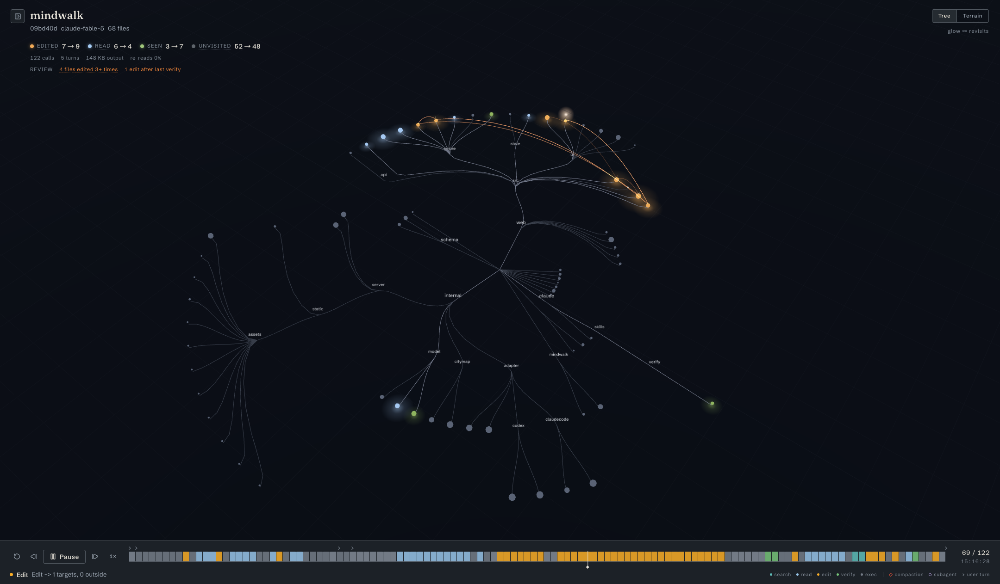

#  mindwalk

Replay a coding agent's walk through your codebase.

mindwalk reads Claude Code and Codex session logs, lines them up against the
repository they touched, and plays the session back as light moving through a
night map of the repo. Where the agent searched, read, and edited, the map
glows — everything else stays dark. It runs entirely locally from one Go
binary; no session data leaves your machine.



## Quick start

```sh
# Install the latest release on macOS or Linux.
curl -fsSL https://raw.githubusercontent.com/cosmtrek/mindwalk/master/scripts/install.sh | sh
export PATH="$HOME/.local/bin:$PATH"
mindwalk
```

The installer downloads the binary for the current OS and CPU from GitHub
Releases, verifies it against `checksums.txt`, and installs it to
`~/.local/bin`. Set `INSTALL_DIR` to choose another destination, or `VERSION`
to install a specific release:

```sh
curl -fsSL https://raw.githubusercontent.com/cosmtrek/mindwalk/master/scripts/install.sh | \
  VERSION=v0.1.0 INSTALL_DIR=/usr/local/bin sh
```

Windows archives and all supported platform binaries are available on the
[GitHub Releases](https://github.com/cosmtrek/mindwalk/releases) page. To build
from source instead, clone the repository and run `make setup && make build`;
the binary is written to `bin/mindwalk`.

With no arguments, mindwalk scans `~/.claude/projects` and `~/.codex/sessions`,
serves the UI on a random local port, and opens a browser. The other commands:

```text
mindwalk serve [--port N] [--no-open] [--claude-dir DIR] [--codex-dir DIR]
mindwalk open [--no-open] <session.jsonl>   open one specific session
mindwalk build <repo> [-o out]              write the repository citymap JSON
mindwalk trace <session> [-o out]           write the normalized trace JSON
```

## Reading the picture

- **Tree view** — the repository as a radial tree: directories branch, files
  are leaves, and glow ∝ depth × revisits.
- **Terrain view** — the same data as a treemap plain, where height stands in
  for glow.
- **Touch states** — each file keeps the deepest touch it received: seen
  (moss green), read (moon white), edited (warm amber), unvisited (dark). The
  HUD counts them live and folds friction signals — error rate, files churned
  3+ times, edits after the last verify — into a review strip.
- **Playback deck** — scrub or play the session. The strip is a bucketed
  histogram of the whole run, each bar colored by its dominant action on a
  cool/warm spectrum: observation stays cool (teal search, moon-blue read,
  slate exec), mutation glows warm (sodium-amber edit, green verify), so
  editing phases jump out of the background hum at a glance. Recent
  transitions draw ember trails between files on the map.
- **Timeline marks** — the lane above the strip carries the session's
  structure: `◇` context compactions, `○` subagent launches, `›` user turns
  (one per typed instruction). Every mark is a click-to-jump target, and the
  key under the strip decodes all of it.
- **Inspector** — click any file to pin its touch facts and per-event visit
  history; clicking a visit row jumps the playhead to that moment.


Keyboard: `Space` play/pause · `←`/`→` step (`⇧` ×10) · `Home`/`End` jump to
the ends · `S` cycle speed · `E` next edit · `X` next error · `M` next mark ·
`⌘B` toggle the session rail.

## How it works

Two artifacts, kept deliberately separate:

1. a **trace** — the session log normalized into an ordered stream of
   file-touch events (`internal/adapter`, one adapter per agent format);
2. a **citymap** — a deterministic layout of the repository
   (`internal/citymap`); the same tree always produces the same map, so
   replays are comparable across sessions.

A local Go server (`internal/server`) joins the two and serves the
React/Three.js frontend (`web`). `schema/` mirrors the exported JSON
contracts.

## Development

```sh
make setup   # install frontend dependencies
make test    # go test + frontend build
make serve   # dev server on :8765, serving web/dist from the working tree
make build   # regenerate embedded assets and bin/mindwalk
```

## Current limits

- Claude Code and Codex main-chain sessions only; Claude sidechain expansion
  is future work.
- Citymaps are built from the live worktree; alignment to the commit a session
  actually ran against (`git ls-tree`) is not implemented yet.
- Trace/citymap caching is in-memory; persistent `~/.cache/mindwalk` storage
  is a follow-up.
